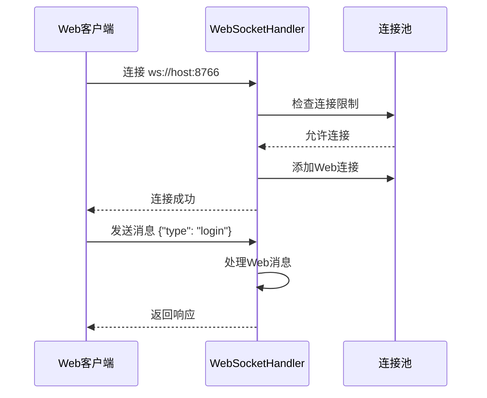
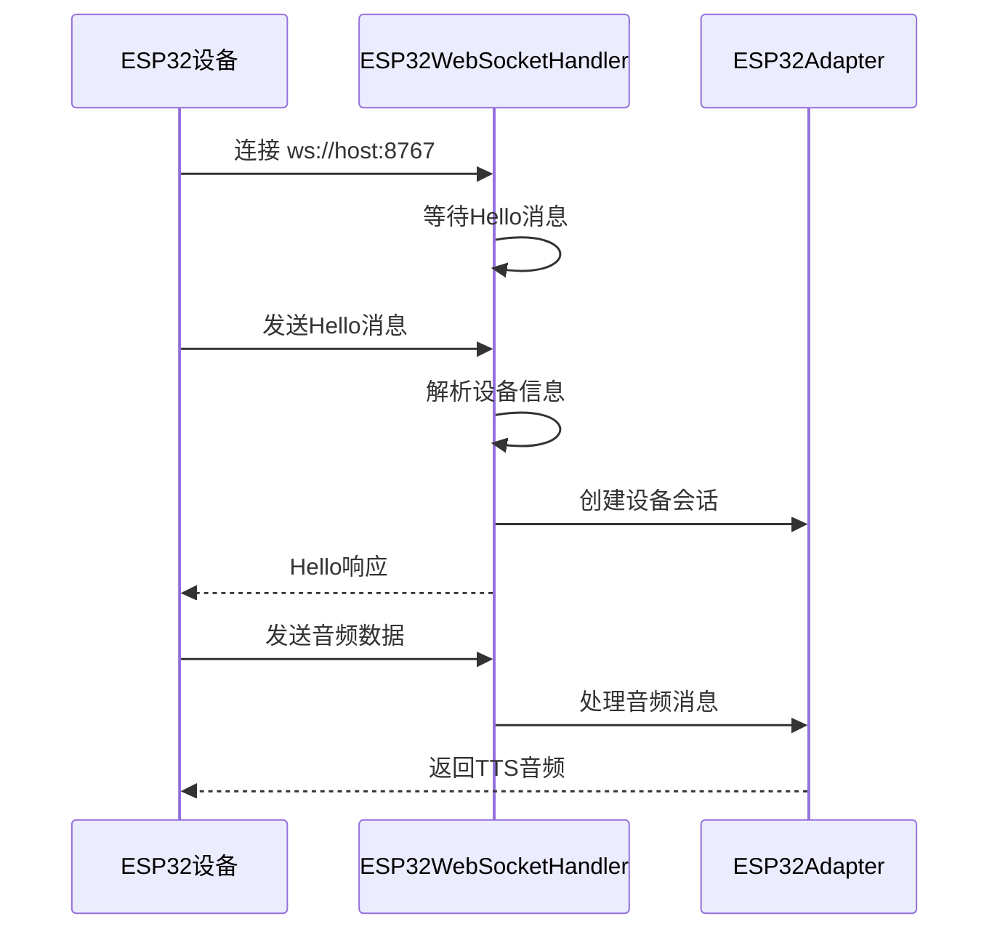

# WebSocket架构设计文档

## 概述

ESP-AI-Server 采用**双端口WebSocket架构**，通过不同的端口和专用处理器来区分Web客户端和ESP32设备，实现工程化的客户端管理。

## 架构设计

### 🏗️ 整体架构

```
┌─────────────────────────────────────────────────────────────┐
│                    ESP-AI-Server                            │
├─────────────────────────────────────────────────────────────┤
│                WebSocket服务管理器                           │
│              (WebSocketServerManager)                       │
├─────────────────────┬───────────────────────────────────────┤
│   Web客户端服务器    │         ESP32设备服务器               │
│   端口: 8766        │         端口: 8767                   │
│   (WebSocketHandler)│    (ESP32WebSocketHandler)           │
└─────────────────────┴───────────────────────────────────────┘
         │                           │
         │                           │
┌─────────────────┐         ┌─────────────────┐
│   Web客户端      │         │   ESP32设备      │
│   (浏览器)       │         │   (硬件)        │
│   ws://host:8766│         │   ws://host:8767│
└─────────────────┘         └─────────────────┘
```

### 📡 端口分配

| 服务类型 | 端口 | 处理器 | 客户端类型 |
|---------|------|--------|-----------|
| Web客户端 | 8766 | WebSocketHandler | 浏览器、Web应用 |
| ESP32设备 | 8767 | ESP32WebSocketHandler | ESP32硬件设备 |
| OTA服务 | 8080 | OTAServer | 固件更新 |

### 🔧 核心组件

#### 1. WebSocketServerManager
- **职责**: 统一管理所有WebSocket服务器
- **功能**: 启动/停止服务器、状态监控、消息路由
- **位置**: `app/web/websocket_server.py`

#### 2. WebSocketHandler (Web专用)
- **职责**: 处理Web客户端连接和消息
- **功能**: 用户认证、聊天对话、功能管理
- **位置**: `app/web/handlers/websocket_handler.py`

#### 3. ESP32WebSocketHandler (ESP32专用)
- **职责**: 处理ESP32设备连接和消息
- **功能**: 设备管理、音频处理、协议适配
- **位置**: `app/web/handlers/esp32_websocket_handler.py`

## 连接流程

### 🌐 Web客户端连接流程



### 🔌 ESP32设备连接流程



## 消息协议

### 📱 Web客户端消息格式

```json
{
  "type": "text_message",
  "data": {
    "message": "用户消息内容",
    "character": "xiaonuan"
  },
  "timestamp": "2025-11-17T13:35:00Z"
}
```

### 🔌 ESP32设备消息格式

#### Hello消息
```json
{
  "type": "hello",
  "device_id": "esp32_001",
  "client_id": "esp32_client",
  "version": "2.0",
  "audio_params": {
    "sample_rate": 16000,
    "frame_duration": 20
  },
  "capabilities": ["audio", "tts", "asr"]
}
```

#### 控制消息
```json
{
  "type": "start_listening",
  "timestamp": "2025-11-17T13:35:00Z"
}
```

## 配置管理

### 📋 配置文件
- **位置**: `config/websocket_config.yaml`
- **内容**: 端口配置、超时设置、设备检测规则

### 🔧 环境变量
- `HOST`: WebSocket服务器主机地址
- `PORT`: Web客户端端口 (ESP32端口自动为PORT+1)
- `MAX_CONNECTIONS`: 最大连接数

## 部署指南

### 🚀 启动服务

```bash
# 启动完整服务
python main.py

# 服务器将自动启动:
# - Web客户端服务器: ws://0.0.0.0:8766
# - ESP32设备服务器: ws://0.0.0.0:8767
# - OTA服务器: http://0.0.0.0:8080
```

### 🔍 连接测试

#### Web客户端测试
```javascript
const ws = new WebSocket('ws://localhost:8766');
ws.onopen = () => {
    ws.send(JSON.stringify({
        type: 'ping',
        timestamp: new Date().toISOString()
    }));
};
```

#### ESP32设备测试
```cpp
// ESP32 Arduino代码示例
#include <WebSocketsClient.h>

WebSocketsClient webSocket;

void setup() {
    webSocket.begin("192.168.1.100", 8767, "/");
    
    // 发送Hello消息
    String hello = "{\"type\":\"hello\",\"device_id\":\"esp32_001\"}";
    webSocket.sendTXT(hello);
}
```

## 监控和调试

### 📊 状态监控
```python
# 获取服务器状态
from app.web.websocket_server import get_websocket_server_manager

manager = get_websocket_server_manager()
status = manager.get_server_status()
print(status)
```

### 🐛 调试技巧
1. **查看连接日志**: 检查 `tomoe-chat.log` 中的连接信息
2. **端口检查**: 确认端口8766和8767都已正确监听
3. **消息追踪**: 启用详细日志记录消息内容

## 最佳实践

### ✅ 推荐做法
1. **明确端口用途**: Web客户端使用8766，ESP32设备使用8767
2. **设备标识**: ESP32设备发送标准Hello消息进行身份识别
3. **错误处理**: 实现完整的连接错误和重连机制
4. **资源管理**: 及时清理断开的连接和相关资源

### ❌ 避免问题
1. **端口混用**: 不要让ESP32设备连接到Web端口
2. **消息格式**: 确保消息格式符合协议规范
3. **连接泄漏**: 避免未正确关闭的WebSocket连接

## 扩展性

### 🔮 未来扩展
1. **多设备类型**: 可以为其他IoT设备添加专用端口
2. **负载均衡**: 支持多实例部署和负载均衡
3. **协议版本**: 支持多版本协议兼容
4. **安全增强**: 添加设备认证和加密通信

---

*更新时间: 2025-11-17*  
*版本: 1.0*
